# Section 1: Introduction

## Overview: Three Papers, One Story

This lecture covers three closely connected papers that develop and debate a radical proposal about visual crowding:

. . .

| Paper | Key contribution |
|-------|-----------------|
| Cicchini, Chopin, & Burr (2022) | Crowding = optimal Bayesian integration (orientation) |
| Cicchini, D'Errico, & Burr (2024) | Same framework extended to color |
| Ozkirli et al. (2025) + Cicchini reply | Replication debate → "flexible integrator" |

. . .

**The thread:** Is crowding a processing bottleneck that destroys information, or an optimal integration strategy that can actually *improve* perception?

## Traditional View of Crowding

**Crowding** = inability to identify peripheral targets when flanked by nearby items.

- The dominant view: crowding is a **bottleneck** — information is compulsory pooled and **lost**
- Nearby items are mixed together indiscriminately
- Crowding should always **hurt** perception

. . .

**Problems with this view:**

- Some studies show perception **improves** under crowding (Manassi et al., 2012; Greenwood et al., 2017)
- Blind pooling should add noise — but identical flankers sometimes **reduce** it
- The bottleneck model cannot explain why effects depend on target–flanker similarity

## The Radical Proposal

**Cicchini et al.'s claim:** Crowding is **optimal Bayesian integration**.

The visual system computes a weighted average of target and flanker information:

- Weights depend on **reliability** of each source
- Weights depend on **similarity** between items
- When flankers match the target → integration **reduces noise**

. . .

This is the same logic as **cue combination** in multisensory integration — but applied to spatial neighbors in crowding.

## Three Testable Predictions

If crowding = Bayesian integration:

| Prediction | Pattern | Why? |
|-----------|---------|------|
| **Bias** | Derivative-of-Gaussian (DoG) | Weight × difference → peaks at intermediate d |
| **Scatter** | U-shape (minimum at d = 0) | Identical flankers = extra measurements → less noise |
| **RMSE** | Minimum at d = 0 | Scatter reduction outweighs bias at d = 0 |

. . .

The scatter prediction is the most radical: it says crowding can make you **more precise** than seeing the target alone.

## Roadmap

1. **Section 2:** The Ideal Observer Model — Cicchini 2022 (orientation)
2. **Section 3:** Color Extension — Cicchini 2024
3. **Section 4:** The 2025 Replication Debate
4. **Section 5:** Synthesis

# Section 2: The Ideal Observer Model — Cicchini 2022

## Experiment 1 Design

::::: columns
::: {.column width="40%"}
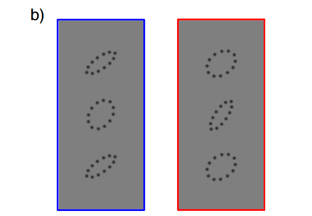
:::

::: {.column width="60%"}
- **Stimuli:** Oriented ovals at 26° eccentricity
- **Layout:** Target + 2 flankers (radial, 5.5° spacing)
- **Task:** Reproduce target orientation (35° or 55°)

**Two key manipulations:**

- $d$ (flanker-target difference): 19 levels from $-45°$ to $+45°$
- $\sigma$ (reliability via aspect ratio): Rounded (high $\sigma \approx 13.2°$) vs Elongated (low $\sigma \approx 10.0°$)

N = 10 observers, 10,699 trials
:::
:::::

## Stimulus Configurations

```{r}
#| fig-width: 14
#| fig-height: 5.5
library(ggplot2)

ellipse_coords <- function(cx, cy, a, b, angle_deg, n = 100) {
  theta <- seq(0, 2 * pi, length.out = n)
  rad <- angle_deg * pi / 180
  x <- a * cos(theta); y <- b * sin(theta)
  data.frame(x = x*cos(rad) - y*sin(rad) + cx, y = x*sin(rad) + y*cos(rad) + cy)
}

elong_a <- 1.0; elong_b <- 0.36
round_a <- 0.92; round_b <- 0.66
target_ori <- 45
d_vals <- c(-45, -30, -15, 0, 15, 30, 45)
col_spacing <- 3.8
row_spacing <- 7.5
oval_spacing <- 2.6

all_polys <- data.frame()
id <- 0
for (ci in 1:2) {
  row_y <- -(ci - 1) * row_spacing
  if (ci == 1) { t_a <- round_a; t_b <- round_b; f_a <- elong_a; f_b <- elong_b
  } else { t_a <- elong_a; t_b <- elong_b; f_a <- round_a; f_b <- round_b }
  for (di in seq_along(d_vals)) {
    cx <- (di - 1) * col_spacing
    flanker_ori <- target_ori + d_vals[di]
    for (info in list(
      list(cx, row_y + oval_spacing, f_a, f_b, flanker_ori, "Flanker"),
      list(cx, row_y, t_a, t_b, target_ori, "Target"),
      list(cx, row_y - oval_spacing, f_a, f_b, flanker_ori, "Flanker")
    )) {
      id <- id + 1
      coords <- ellipse_coords(info[[1]], info[[2]], info[[3]], info[[4]], info[[5]])
      coords$id <- id; coords$role <- info[[6]]
      all_polys <- rbind(all_polys, coords)
    }
  }
}

d_labels_df <- data.frame(
  x = (seq_along(d_vals) - 1) * col_spacing,
  y = oval_spacing + 2.2,
  label = paste0("d = ", ifelse(d_vals > 0, "+", ""), d_vals, "\u00b0")
)

row_labels_df <- data.frame(
  x = -2.8,
  y = c(0, -row_spacing),
  label = c(
    "Rounded T (\u03c3\u224813\u00b0)\nElongated F (\u03c3\u224810\u00b0)",
    "Elongated T (\u03c3\u224810\u00b0)\nRounded F (\u03c3\u224813\u00b0)"
  )
)

ggplot(all_polys, aes(x = x, y = y, group = id)) +
  geom_polygon(aes(fill = role, color = role), linewidth = 0.7, alpha = 0.75) +
  scale_fill_manual(values = c("Target" = "#DC143C", "Flanker" = "#1565C0")) +
  scale_color_manual(values = c("Target" = "#B71C1C", "Flanker" = "#0D47A1")) +
  geom_segment(aes(x = -3.5, xend = (length(d_vals) - 1) * col_spacing + 1.5,
                   y = -row_spacing / 2, yend = -row_spacing / 2),
               inherit.aes = FALSE, linewidth = 0.4, color = "grey60", linetype = "dashed") +
  geom_text(data = d_labels_df, aes(x = x, y = y, label = label),
            inherit.aes = FALSE, size = 4.5, fontface = "bold") +
  geom_text(data = row_labels_df, aes(x = x, y = y, label = label),
            inherit.aes = FALSE, size = 4, hjust = 1, lineheight = 0.9) +
  coord_fixed(clip = "off") +
  theme_void(base_size = 13) +
  theme(
    legend.position = "bottom", legend.title = element_blank(),
    legend.text = element_text(size = 12),
    plot.title = element_text(face = "bold", hjust = 0.5, size = 15),
    plot.subtitle = element_text(hjust = 0.5, size = 11, color = "#B71C1C"),
    plot.margin = margin(5, 15, 5, 80)
  ) +
  labs(
    title = "Stimulus configurations (target at 45\u00b0)",
    subtitle = "\u03c3T \u2260 \u03c3F in every condition \u2014 no equal-reliability condition tested"
  )
```

## What is an Ideal Observer?

An ideal observer is a hypothetical system that performs **optimally** given the available sensory information.

- Knows the forward model perfectly
- Knows the prior perfectly
- Uses **optimal Bayesian inference** without error
- Has no additional limitations (no neural noise, memory, attention)

. . .

**Why use it?** It sets an **upper bound** on performance.

| Comparison | Interpretation |
|-----------|---------------|
| Human = Ideal | Limited only by early encoding |
| Human < Ideal | Additional factors limit performance |
| Human $\approx$ Ideal | System may be near-optimal |

## Response Equation (Eq 2–3)

The ideal response is a weighted combination of target and flankers:

$$R = w \cdot F_1 + w \cdot F_2 + (1 - 2w) \cdot T$$

- $T$ = noisy target representation ($T + \epsilon_T$, where $\epsilon_T \sim \mathcal{N}(0, \sigma_T^2)$)
- $F_1, F_2$ = noisy flanker representations ($F_i + \epsilon_{F_i}$, where $\epsilon_{F_i} \sim \mathcal{N}(0, \sigma_F^2)$)
- $w$ = integration weight per flanker

. . .

```{r}
#| fig-width: 10
#| fig-height: 4
library(ggplot2)

# Box positions: xmin, xmax, ymin, ymax
box_df <- data.frame(
  xmin = c(0.3, 0.3, 0.3, 3.3, 5.7),
  xmax = c(1.7, 1.7, 1.7, 4.7, 6.9),
  ymin = c(3.4, 1.8, 0.2, 1.4, 1.4),
  ymax = c(4.4, 2.8, 1.2, 3.2, 3.2),
  fill   = c("#B0C4DE", "#FFD700", "#B0C4DE", "#C8E6C9", "#FFE0B2"),
  border = c("#4682B4", "#B8860B", "#4682B4", "#388E3C", "#E65100")
)

ggplot() +
  # Boxes
  geom_rect(data = box_df,
            aes(xmin = xmin, xmax = xmax, ymin = ymin, ymax = ymax),
            fill = box_df$fill, color = box_df$border, linewidth = 1.5) +
  # F1
  annotate("text", x = 1, y = 4.55, label = "Flanker 1",
           size = 3.5, color = "#4682B4", fontface = "italic") +
  annotate("text", x = 1, y = 3.9, label = expression(italic(F)[1]), size = 9) +
  # Target
  annotate("text", x = 1, y = 2.95, label = "Target",
           size = 3.5, color = "#B8860B", fontface = "italic") +
  annotate("text", x = 1, y = 2.3, label = expression(italic(T)), size = 9) +
  # F2
  annotate("text", x = 1, y = 1.35, label = "Flanker 2",
           size = 3.5, color = "#4682B4", fontface = "italic") +
  annotate("text", x = 1, y = 0.7, label = expression(italic(F)[2]), size = 9) +
  # Weighted Average
  annotate("text", x = 4.0, y = 2.5, label = "Weighted",
           size = 5.5, fontface = "bold", color = "#2E7D32") +
  annotate("text", x = 4.0, y = 2.1, label = "Average",
           size = 5.5, fontface = "bold", color = "#2E7D32") +
  # Response
  annotate("text", x = 6.3, y = 2.55, label = expression(italic(R)),
           size = 10, color = "#BF360C") +
  annotate("text", x = 6.3, y = 2.0, label = "Response",
           size = 4, color = "#E65100", fontface = "italic") +
  # Arrows: inputs → weighted average
  geom_segment(aes(x = 1.7, y = 3.9, xend = 3.3, yend = 2.9),
               arrow = arrow(length = unit(0.15, "cm"), type = "closed"),
               linewidth = 0.8, color = "grey30") +
  geom_segment(aes(x = 1.7, y = 2.3, xend = 3.3, yend = 2.3),
               arrow = arrow(length = unit(0.15, "cm"), type = "closed"),
               linewidth = 0.8, color = "grey30") +
  geom_segment(aes(x = 1.7, y = 0.7, xend = 3.3, yend = 1.7),
               arrow = arrow(length = unit(0.15, "cm"), type = "closed"),
               linewidth = 0.8, color = "grey30") +
  # Arrow: weighted average → response
  geom_segment(aes(x = 4.7, y = 2.3, xend = 5.7, yend = 2.3),
               arrow = arrow(length = unit(0.15, "cm"), type = "closed"),
               linewidth = 0.8, color = "grey30") +
  # Weight labels on arrows
  annotate("text", x = 2.4, y = 3.6, label = expression(italic(w)),
           size = 5, color = "#B8860B", fontface = "bold") +
  annotate("text", x = 2.6, y = 2.5, label = expression(1 - 2*italic(w)),
           size = 5, color = "#B8860B", fontface = "bold") +
  annotate("text", x = 2.4, y = 1.0, label = expression(italic(w)),
           size = 5, color = "#B8860B", fontface = "bold") +
  coord_cartesian(xlim = c(0, 7.3), ylim = c(-0.1, 4.8)) +
  theme_void()
```

## Optimal Weight (Eq 10)

$$w_{opt} = \frac{\sigma_T^2}{2\sigma_T^2 + \sigma_F^2 + 2d^2}$$

**Intuition:**

- Noisier target ($\sigma_T$ large) → more weight on flankers
- Flankers more different ($d$ large) → less weight on flankers
- Noisier flankers ($\sigma_F$ large) → less weight on flankers

```{r}
#| fig-width: 10
#| fig-height: 3.5
library(ggplot2)
library(patchwork)

d <- seq(0, 45, by = 0.5)
params <- list(
  list(sT = 12, sF = 6,  lab = "Low reliability target"),
  list(sT = 8,  sF = 8,  lab = "Equal reliability"),
  list(sT = 6,  sF = 12, lab = "High reliability target")
)

sim <- do.call(rbind, lapply(params, function(p) {
  w <- p$sT^2 / (2 * p$sT^2 + p$sF^2 + 2 * d^2)
  data.frame(d = d, w = w, condition = p$lab)
}))
sim$condition <- factor(sim$condition, levels = sapply(params, `[[`, "lab"))

cols <- c("Low reliability target" = "#1565C0",
          "Equal reliability" = "#6A1B9A",
          "High reliability target" = "#C62828")

ggplot(sim, aes(x = d, y = w, color = condition)) +
  geom_line(linewidth = 1.3) +
  scale_color_manual(values = cols) +
  labs(x = "Flanker-Target difference (d)", y = "Integration weight (w)",
       title = "Weight decreases with d \u2014 faster for reliable targets") +
  theme_minimal(base_size = 14) +
  theme(legend.position = "bottom", legend.title = element_blank(),
        plot.title = element_text(face = "bold", hjust = 0.5))
```

## Predicted Bias: Derivative-of-Gaussian (Eq 7)

Bias = systematic shift toward flankers:

$$\text{Bias}(d) = 2w \cdot d$$

- At $d = 0$: $w$ maximal, but $2w \cdot 0 = 0$ → **no bias**
- At small $d$: $w$ still large, $d$ growing → bias **increases**
- At large $d$: $w \to 0$ faster than $d$ grows → bias **decreases**

. . .

This product of a rising ($d$) and falling ($w$) term produces a **Derivative-of-Gaussian (DoG)** shape.

## Predicted Scatter: U-Shape (Eq 8)

$$S^2 = 2w^2\sigma_F^2 + (1 - 2w)^2\sigma_T^2$$

- At $d = 0$: $w$ maximal → target noise **down-weighted**, flanker info supplements → scatter **minimized**
- At large $d$: $w \to 0$ → scatter = $\sigma_T$ (no benefit from flankers)

. . .

This produces a **U-shape**: precision is best when flankers match the target.

## Model Simulation: Bias, Scatter, and RMSE

RMSE combines bias and scatter: $\text{RMSE} = \sqrt{\text{Bias}^2 + S^2}$

```{r}
#| fig-width: 14
#| fig-height: 4.5
library(ggplot2)
library(patchwork)

d_full <- seq(-45, 45, by = 0.5)

params <- list(
  list(sT = 12, sF = 6,  lab = "Low reliability target"),
  list(sT = 8,  sF = 8,  lab = "Equal reliability"),
  list(sT = 6,  sF = 12, lab = "High reliability target")
)

cols <- c("Low reliability target" = "#1565C0",
          "Equal reliability" = "#6A1B9A",
          "High reliability target" = "#C62828")

sim <- do.call(rbind, lapply(params, function(p) {
  w <- p$sT^2 / (2 * p$sT^2 + p$sF^2 + 2 * d_full^2)
  bias <- 2 * w * d_full
  scatter <- sqrt((1 - 2*w)^2 * p$sT^2 + 2 * w^2 * p$sF^2)
  rmse <- sqrt(bias^2 + scatter^2)
  data.frame(d = d_full, bias = bias, scatter = scatter, rmse = rmse, condition = p$lab)
}))
sim$condition <- factor(sim$condition, levels = sapply(params, `[[`, "lab"))

th <- theme_minimal(base_size = 13) +
  theme(legend.position = "none", plot.title = element_text(face = "bold", hjust = 0.5))

p1 <- ggplot(sim, aes(x = d, y = bias, color = condition)) +
  geom_hline(yintercept = 0, linetype = "dashed", color = "grey60") +
  geom_vline(xintercept = 0, linetype = "dashed", color = "grey60") +
  geom_line(linewidth = 1.2) +
  scale_color_manual(values = cols) +
  labs(title = "Bias: DoG shape", x = "Flanker-Target difference (d)", y = "Bias") + th

p2 <- ggplot(sim, aes(x = d, y = scatter, color = condition)) +
  geom_vline(xintercept = 0, linetype = "dashed", color = "grey60") +
  geom_line(linewidth = 1.2) +
  scale_color_manual(values = cols) +
  labs(title = "Scatter: U-shape", x = "Flanker-Target difference (d)", y = "Scatter (SD)") + th

p3 <- ggplot(sim, aes(x = d, y = rmse, color = condition)) +
  geom_vline(xintercept = 0, linetype = "dashed", color = "grey60") +
  geom_line(linewidth = 1.2) +
  scale_color_manual(values = cols) +
  labs(title = "RMSE: Minimum at d = 0", x = "Flanker-Target difference (d)", y = "RMSE") + th

p1 + p2 + p3 + plot_layout(guides = "collect") &
  theme(legend.position = "bottom", legend.title = element_blank())
```

## Causal Inference Extension (Eq 12–14)

The basic IO **always** integrates. The Causal Inference (CI) model adds a **gating step**:

$$w = w_{max} \cdot P(\text{common cause} \mid d)$$

$$P(\text{common cause} \mid d) \propto \exp\!\left(-\frac{d^2}{2(\sigma_T^2 + \sigma_F^2)}\right)$$

- When $d = 0$: $P \approx 1$ → integrate fully
- When $d$ is large: $P \approx 0$ → do not integrate

## IO vs CI Model Comparison

```{r}
#| fig-width: 12
#| fig-height: 4
library(ggplot2)
library(patchwork)

d <- seq(-45, 45, by = 0.5)
sigma_T <- 10; sigma_F <- 10
sigma_sum <- sigma_T^2 + sigma_F^2

P_cc <- exp(-d^2 / (2 * sigma_sum))
w_max <- sigma_T^2 / (sigma_T^2 + sigma_F^2)
w_basic <- sigma_T^2 / (2 * sigma_T^2 + sigma_F^2 + 2 * d^2)
w_ci <- w_max * P_cc

df <- data.frame(d = d, P_cc = P_cc, w_basic = w_basic, w_ci = w_ci)

th <- theme_minimal(base_size = 14) +
  theme(plot.title = element_text(face = "bold", hjust = 0.5))

p1 <- ggplot(df, aes(x = d, y = P_cc)) +
  geom_line(linewidth = 1.3, color = "#E65100") +
  geom_hline(yintercept = 0, linetype = "dotted", color = "grey50") +
  geom_hline(yintercept = 1, linetype = "dotted", color = "grey50") +
  scale_y_continuous(limits = c(-0.05, 1.15), breaks = seq(0, 1, 0.25)) +
  labs(title = "P(common cause | d)",
       x = "Flanker-Target difference (d)", y = "Probability") + th

df_long <- data.frame(
  d = rep(d, 2),
  w = c(w_basic, w_ci),
  model = rep(c("Basic: always integrates", "Causal Inference: gated"), each = length(d))
)

p2 <- ggplot(df_long, aes(x = d, y = w, color = model)) +
  geom_line(linewidth = 1.3) +
  scale_color_manual(values = c("Basic: always integrates" = "#1565C0",
                                 "Causal Inference: gated" = "#E65100")) +
  labs(title = "Flanker weight: Basic vs CI model",
       x = "Flanker-Target difference (d)", y = "Weight (w)") +
  th + theme(legend.position = "bottom", legend.title = element_blank())

p1 + p2
```

**Key:** Basic IO always integrates ($w > 0$). CI model gates integration on/off via P(common cause).

## Result 1: Assimilative Bias

::::: columns
::: {.column width="50%"}
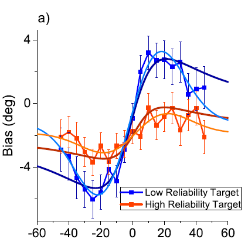
:::

::: {.column width="50%"}
- Bias follows a **DoG** — zero at $d = 0$, peaks at ~15–20°
- Unreliable target (blue) shows **~3x larger** bias
- IO fits with **1 free parameter** (R² = .93 blue, .37 orange)
- CI slightly better with **2 parameters** (R² = .97, .73)
:::
:::::

## Result 2: Precision Improves

::::: columns
::: {.column width="50%"}
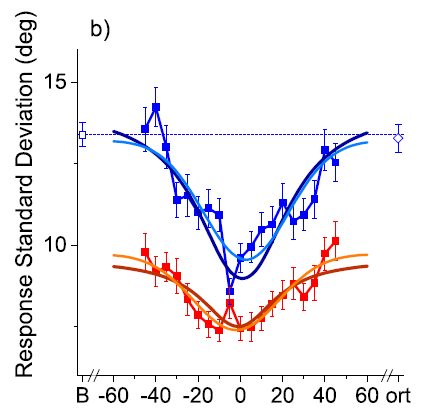
:::

::: {.column width="50%"}
- Scatter shows a **U-shape** — minimum at $d = 0$
- At $d = 0$: scatter drops **below the unflanked baseline**
- This is the **opposite** of bottleneck models
- IO scatter R² = .71 (blue), .74 (orange)
:::
:::::

## Result 3: Total Error (RMSE)

::::: columns
::: {.column width="50%"}
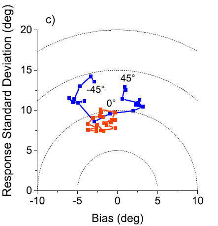
:::

::: {.column width="50%"}
- Blue (unreliable target) at $d = 0°$ reaches closer to origin than most orange points
- Integration of identical flankers makes an unreliable target perform *better* than a reliable one alone
- **"Crowding superiority effect"**: identical flankers improve total accuracy beyond the unflanked baseline
:::
:::::

## Experiment 2: Distance Effect

::::: columns
::: {.column width="50%"}
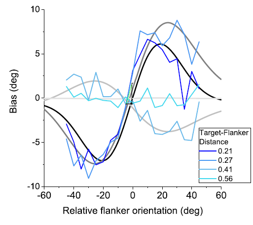
:::

::: {.column width="50%"}
- 4 target-flanker spacings at 26° eccentricity
- **Dark navy** (closest): strongest DoG, same as Exp 1
- **Cyan** (farthest): essentially flat — no integration
- Integration only operates **within the crowding zone**
:::
:::::

## Weight Follows Bouma's Law

::::: columns
::: {.column width="50%"}
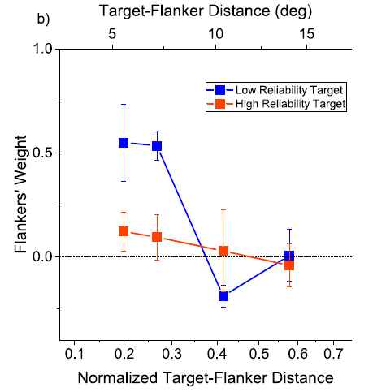
:::

::: {.column width="50%"}
- Unreliable target (blue): weight ~0.5 close, drops to 0 at far distances
- Reliable target (orange): near zero at all distances
- Weight crosses zero between 0.3–0.4 → matches **Bouma's critical spacing**
- Confirms this is crowding, not some other effect
:::
:::::

## Experiment 3: Global Integration Design

::::: columns
::: {.column width="50%"}
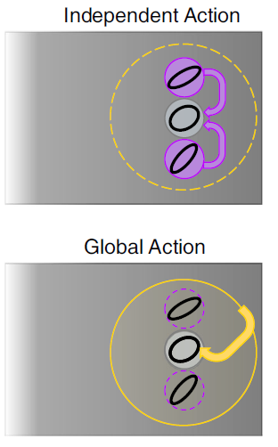

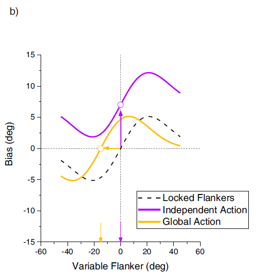
:::

::: {.column width="50%"}
**Question:** Do flankers bias the target *independently*, or does the system compute a **flanker average** first?

- **Independent** (top): each flanker acts on target separately
- **Global** (bottom): flankers pooled first, then bias target

**Key prediction:** DoG centered at **0°** (independent) vs **-15°** (global)
:::
:::::

## Experiment 3: Global Integration Results

::::: columns
::: {.column width="50%"}
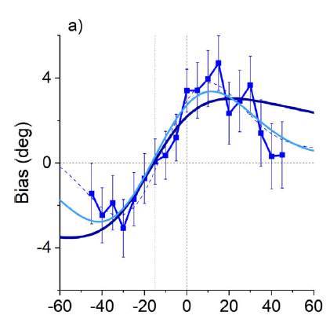
:::

::: {.column width="50%"}
- DoG center at **-10.8°**, close to -15° global prediction
- Far from 0° independent prediction
- Bootstrap: only 16/1000 iterations closer to 0° → **BF = 61.5** for global model
- The visual system **pools both flankers first**, then biases the target
:::
:::::

## Experiment 3: Scatter Confirmation

::::: columns
::: {.column width="50%"}
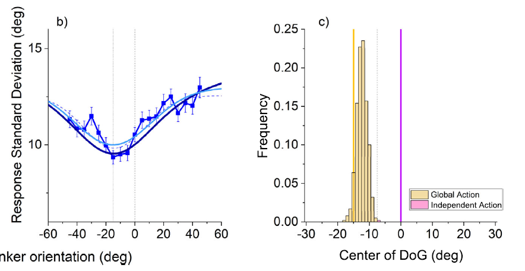
:::

::: {.column width="50%"}
- Scatter U-shape center at **-14.3°**, again near -15°
- Consistent with global integration architecture
- IO R² = .76 (scatter), CI R² = .78
:::
:::::

## Section 2 Summary

| Prediction | Confirmed? | Key finding |
|-----------|-----------|-------------|
| DoG bias | Yes | S-shaped, reliability-dependent |
| U-shaped scatter | Yes | Precision improves at d = 0, below unflanked baseline |
| RMSE minimum at d = 0 | Yes | "Crowding superiority effect" |
| Distance dependence | Yes | Follows Bouma's law |
| Global integration | Yes | Flankers pooled first (BF = 61.5) |

# Section 3: Color Extension — Cicchini 2024

## Why Test Color?

| | Cicchini 2022 | Cicchini 2024 |
|---|---|---|
| **Feature** | Orientation | Color (hue) |
| **Reliability** | Shape-based (rounded vs elongated) | Purity-based (desaturated vs saturated) |
| **Task** | Reproduce orientation | 2AFC: "pinker or greener?" |
| **New evidence** | — | Reaction times confirm sensory-level effect |

. . .

**Goal:** Show that optimal integration in crowding is **not feature-specific** — it's a general strategy.

## Experiment Design

::::: columns
::: {.column width="50%"}
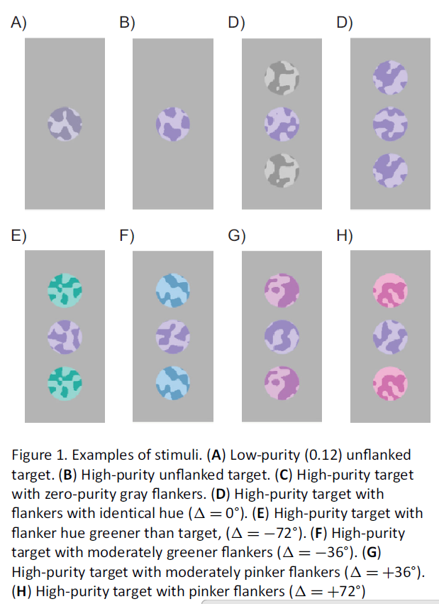
:::

::: {.column width="50%"}
- Cowhide-textured patches at 17.6° eccentricity
- Target + 2 radial flankers, within Bouma's zone
- 2AFC: "pinker or greener than reference?"
- Flanker-target hue difference: 0°, ±36°, ±72°
- **Reliability:** low purity target (0.12, unreliable) vs high purity (0.34, reliable)
- N = 9 + 13, 20,666 trials
:::
:::::

## Result: Assimilative Bias

::::: columns
::: {.column width="50%"}
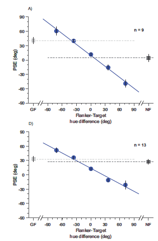
:::

::: {.column width="50%"}
- Perceived color **shifts toward flanker hue**
- Low purity: slope = **0.76** (flankers dominate)
- High purity: slope = **0.53** (target contributes more)
- Unreliable targets give more weight to flankers — **reliability-weighted** integration
:::
:::::

## Result: Precision Improves (JND)

::::: columns
::: {.column width="50%"}
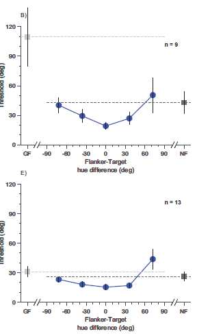
:::

::: {.column width="50%"}
- When flankers match target ($\delta = 0$): precision significantly improves
- JND drops to **0.45x** (low purity) and **0.58x** (high purity) of baseline
- 0.58 $\approx$ **1/$\sqrt{3}$** — theoretical optimum for averaging 3 equally reliable items
:::
:::::

## Result: Total Error

::::: columns
::: {.column width="50%"}
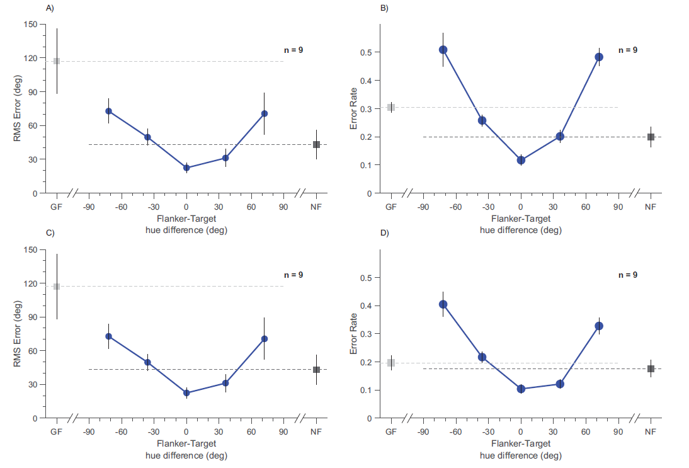
:::

::: {.column width="50%"}
- RMSE lowest at $\delta = 0$: only **0.52x** unflanked
- For low purity, **all** flanker conditions have lower RMSE than gray-flanker control
- Error rate lowest with matching, soaring with mismatched flankers
:::
:::::

## Result: RT Confirms Sensory Integration

::::: columns
::: {.column width="50%"}
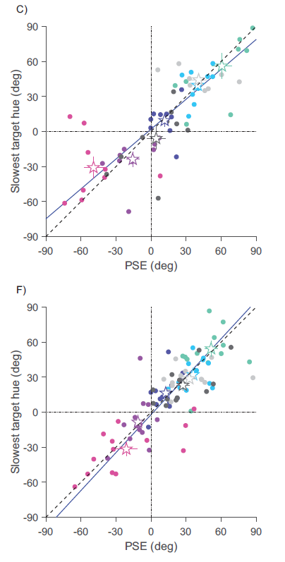
:::

::: {.column width="50%"}
- RT peaks and PSE shifts tightly correlated: **r = 0.83–0.84**
- This rules out a response strategy
- Flankers change **what the target looks like**, not just which button is pressed
- **New evidence not in 2022**
:::
:::::

## Against Alternatives

**Substitution:** Maybe observers accidentally report the flanker? But substitution = mixing two distributions → curve gets **broader**. Data shows curves getting **narrower** → system is **averaging**, not randomly picking.

. . .

**Greenwood & Parsons (2020):** Found crowding **hurts** precision. But they **fixed** flanker hue to reference → uncontrolled flanker-target difference across trials. Key: flankers only help when **yoked** to the target.

## Section 3 Summary

All three predictions confirmed for color:

| Metric | Result |
|--------|--------|
| Bias slope | 0.76 (unreliable) vs 0.53 (reliable) — reliability-weighted |
| JND at $\delta = 0$ | 0.58x baseline $\approx 1/\sqrt{3}$ (optimal 3-item average) |
| RMSE at $\delta = 0$ | 0.52x baseline |
| RT correlation | r = 0.83–0.84 — sensory-level integration |

. . .

**Crowding as optimal integration is not feature-specific — it's a general spatial strategy.**

# Section 4: The 2025 Debate

## What's at Stake

| | Ozkirli et al. 2025 | Cicchini et al. 2022 |
|---|---|---|
| **N** | 20 | 10 (main) + 8 (control) |
| **Design** | Within-subjects | Between-subjects for baseline |
| **Target orientations** | Same across conditions | Different for flanked vs unflanked |
| **Data analysis** | Per-participant | Aggregated |
| **Scatter pattern** | M-shape | U-shape |
| **Claim** | Crowding only deteriorates | Crowding can improve |

## Ozkirli: Replication Design

- Same paradigm: oriented ovals at 26° eccentricity, orientation reproduction
- **N = 20** naive participants (doubled from N = 10)
- **All conditions in one session** — flanked and unflanked counterbalanced
- **Same target orientations** (35°/55°) for all conditions (fixing a confound)
- **Per-participant analysis** (not aggregated)
- 13,440 trials total

## Result: M-shape Not U-shape

::::: columns
::: {.column width="50%"}
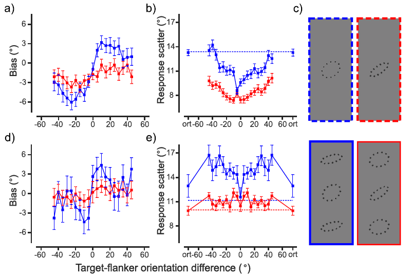
:::

::: {.column width="50%"}
**Top:** Cicchini's original — U-shape, minimum at d = 0.

**Bottom:** Ozkirli's replication — **M-shape**. Scatter similar at d = 0 and 90°, worst at intermediate d.

**Bayes factors:**

- d = ±5–45°: BF = 6450 — decisive **deterioration**
- d = 0°: BF = 0.25 — evidence for **no difference**
- d = 90°: BF = 0.24–0.56 — **no difference**
:::
:::::

## Methodological Criticisms

**Cicchini 2022 problems identified by Ozkirli:**

1. **Different participant groups** for main experiment vs control (separate sessions, 3 years apart)
2. **Different target orientations** — flanked used 35°/55°, unflanked used 0°/22.5°/67.5°/90°
3. **Aggregated data** — bias and scatter from pooled group data, not per participant

. . .

**Theoretical concerns:**

- No superiority effects in prior crowding literature
- M-shape consistent with Livne & Sagi (2011), Solomon et al. (2004), Glen & Dakin (2013)

## Cicchini Reply: Replication 1 — Orientation Reproduction

::::: columns
::: {.column width="50%"}
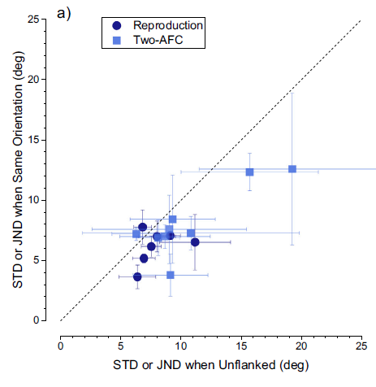
:::

::: {.column width="50%"}
**Fig 1a:** Each point = one participant. Below diagonal = flankers helped.

**Navy circles (N = 7):** Same task, identical flankers only, same orientations across conditions.

- 6/7 below the line
- Scatter: 8.0° → 6.2°, **22% reduction**
- t(6) = 2.8, p = .029, d = 1.16
:::
:::::

## Cicchini Reply: Replication 2 — Full Range (2AFC)

::::: columns
::: {.column width="50%"}
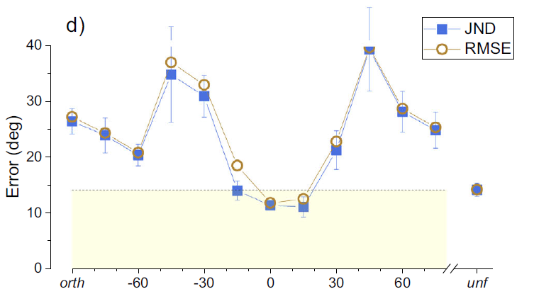
:::

::: {.column width="50%"}
**Fig 1d:** Blue = JND, brown = RMSE. Yellow zone = better than unflanked.

- **At d = 0°:** JND in yellow zone — **superiority confirmed**
- JND ratio 95% CI = [0.64, 0.94], t(8) = 3.15, p = .013
- **At d = ±30° to ±60°:** JND rises above baseline — **M-shape confirmed too**
- **Both findings replicate:** superiority at d = 0 AND M-shape at dissimilar d
:::
:::::

## Cicchini Reply: Replication 3 — Color (2AFC)

::::: columns
::: {.column width="50%"}
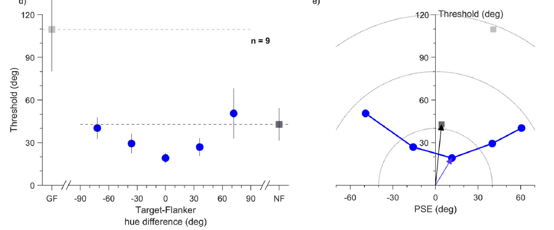
:::

::: {.column width="50%"}
- 2AFC: "pinker or greener than standard?"
- At $\delta = 0$ and ±36°: precision **below** both unflanked and gray-flanker baselines
- Gray flankers provide no benefit — integration requires **informative** flankers
- Extends to color: superiority effect is not orientation-specific
:::
:::::

## The Concession: "Flexible Integrator"

Cicchini et al. acknowledge key limitations:

- **M-shape confirmed** in their own data — "incompatible with a strict Bayesian approach"
- Human performance only **~50%** of ideal observer predictions
- Revised framework: not a rigid ideal observer, but a **"flexible integrator"**

. . .

**Against substitution** (Ozkirli's alternative):

- If substitution, flanker influence should be **same** regardless of target reliability
- But all datasets show **less** influence when target is reliable → reliability-weighted
- When target = flanker, substitution changes nothing — yet precision still improves

## Common Ground

**What both sides agree on:**

1. Identical flankers improve (or at least don't hurt) precision
2. M-shape at dissimilar flankers
3. No irretrievable information loss — crowding is not a simple bottleneck
4. Global statistics matter — ensemble coding plays a role

## Remaining Disagreements

| Issue | Ozkirli | Cicchini |
|-------|---------|----------|
| **Magnitude at d = 0** | No improvement beyond baseline | 22% improvement (significant) |
| **Mechanism** | Probabilistic substitution | Reliability-weighted integration |
| **Framework** | "Crowding only deteriorates" | "Flexible integrator, broadly Bayesian" |

## Section 4 Summary

| Finding | Status |
|---------|--------|
| DoG bias | Replicated by both labs |
| U-shape scatter | **Not replicated** — M-shape instead |
| Superiority at d = 0 | Cicchini replicates (3x), Ozkirli finds no change |
| M-shape at dissimilar d | **Both labs agree** |
| Strict IO model | **Rejected** — replaced by "flexible integrator" |

# Section 5: Synthesis

## Key Takeaways

**1.** Crowding is not a simple bottleneck — it involves **reliability-weighted integration** of nearby items.

. . .

**2.** Three predictions confirmed across orientation and color: DoG bias, precision improvement, RMSE reduction with identical flankers.

. . .

**3.** The 2025 debate refined the model: not a rigid ideal observer, but a **"flexible integrator"** that follows Bayesian principles at d = 0 but deviates at large differences.

. . .

**4.** For identical items (d = 0), all parties agree: integration is beneficial or at minimum harmless.

## The Story Arc

$$\text{Optimal (2022)} \longrightarrow \text{Challenged (2025)} \longrightarrow \text{Flexible integrator}$$

- **2022:** Bold claim — crowding is *optimal* Bayesian integration
- **2024:** Extended to color — not feature-specific
- **2025 challenge:** M-shape, not U-shape; no superiority in replication
- **2025 reply:** Superiority at d = 0 replicated 3x; M-shape conceded at large d
- **Current status:** "Flexible integrator" — broadly Bayesian, clearly beneficial for identical items

## References

**Primary papers:**

- Cicchini, G. M., Chopin, A., & Burr, D. C. (2022). Crowding as optimal integration. *Journal of Vision*, 22(10), 3.
- Cicchini, G. M., D'Errico, G., & Burr, D. C. (2024). Color crowding considered as adaptive spatial integration. *Journal of Vision*, 24(13), 9.
- Ozkirli, A., Pascucci, D., & Herzog, M. H. (2025). Failure to replicate a superiority effect in crowding. *Nature Communications*, 16, 1637.
- Cicchini, G. M., D'Errico, G., & Burr, D. C. (2025). Reply to: Failure to replicate a superiority effect in crowding. *Nature Communications*, 16, 1638.

**Related:**

- Greenwood, J. A., & Parsons, M. J. (2020). Crowding of color. *PNAS*.
- Livne, T., & Sagi, D. (2011). Multiple levels of orientation anisotropy in crowding. *JOV*.
- Körding, K. P., et al. (2007). Causal inference in multisensory perception. *PLoS ONE*.
